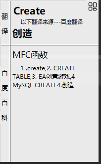
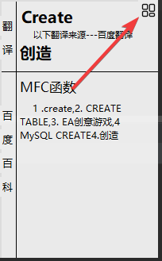
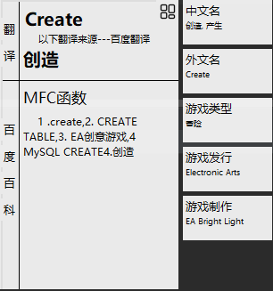
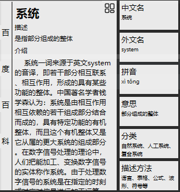
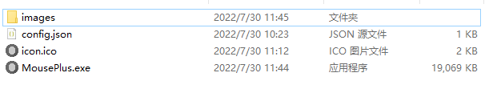

# MiddleMouseButtonPlus

> *注意本项目全部接口来源百度sdk

## 使用说明

在任何位置CTRL+C 后点击鼠标中键 将弹出窗口



如果有对应卡片可以通过点击右上角获取



打开小卡片如下



点击百度百科页面后将直接跳转到相应页面


也支持中文搜索




主函数为 

```python
midmousebt.py
```

## 软件包

打包语句

```bash
pyinstaller -F -i icon.ico --version-file=file_version_info.txt midmousebt.py -w
```

也可以使用打包完成的软件



确保软件包中含有四个文件，否则将无法运行

双击MousePlus.exe后，大约3秒后程序开始运行